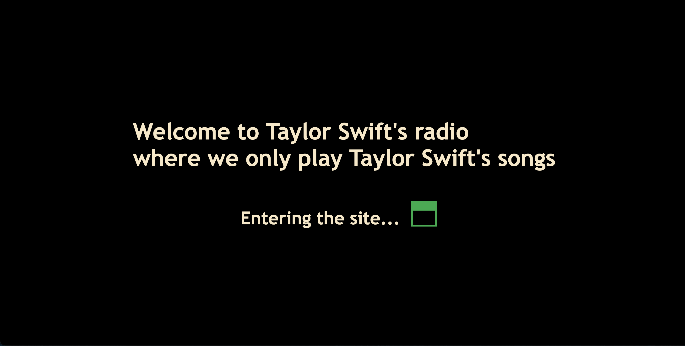
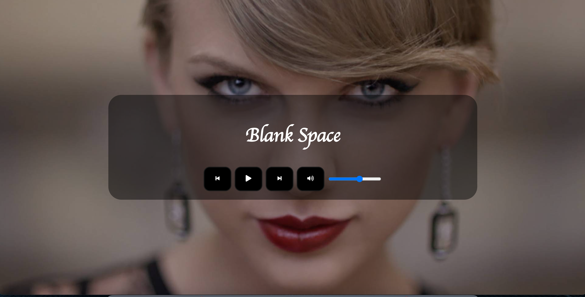

# React Music Player

-Live: https://taylorswiftradio.netlify.app/

## Demo

### Landing Page

### Music Player

## Purpose

- The purpose was to create a music player app in React

## TechStack

- React + SCSS (for styling)

## Features

- Play button changes to pause button on click
- Forward skip moves to the next song
- Backward skip moves to the previous song
- Volume button turns to mute when clicked
- Volume bar shows the level of volume as well as changes the volume button to mute button when volume is turned down to zero
- Progress bar shows current and total time. It can also be used to control the progress of the song

Update: Replaced setInterval() with requestAnimationFrame()

## Future Goals

- [x] Add a progress bar
- [ ] Add list of songs to choose from
